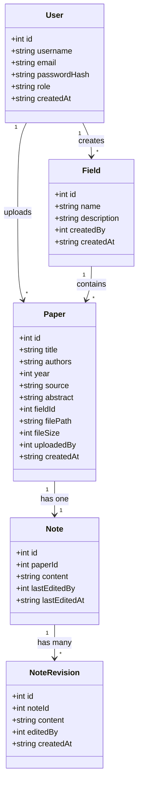
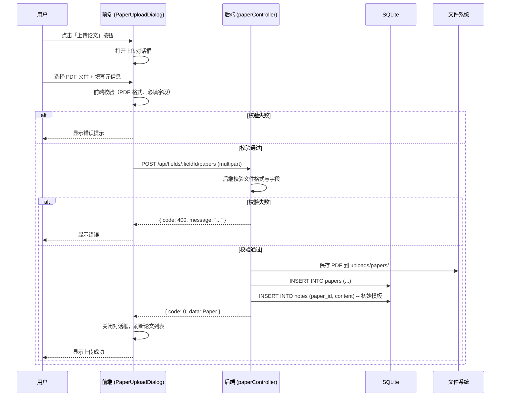
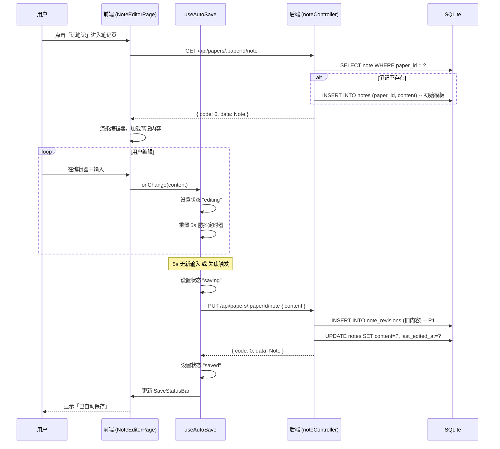
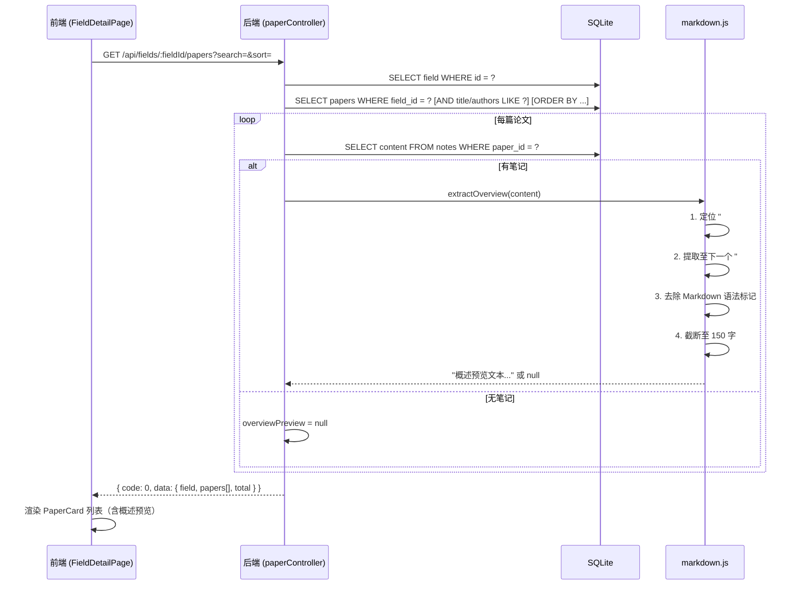
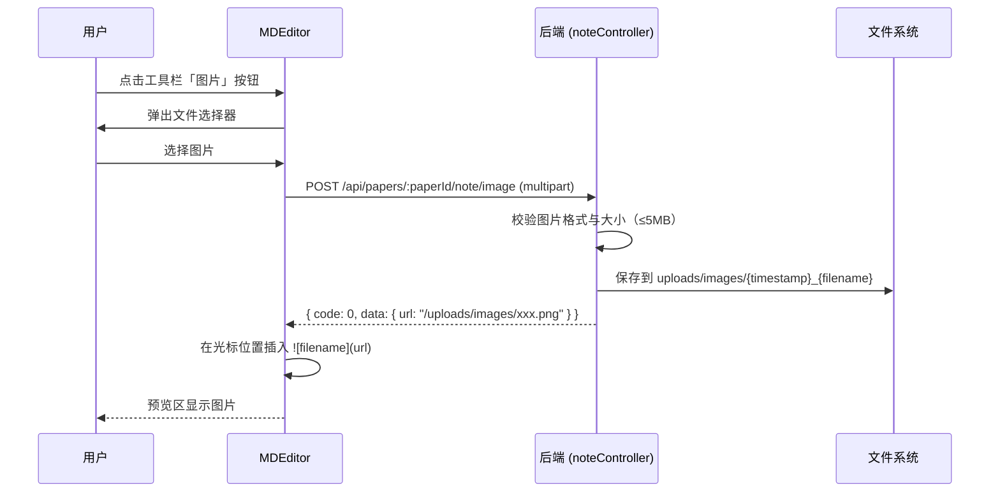
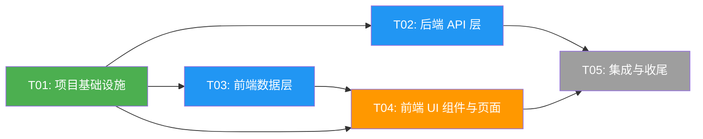

# 技术架构设计文档：实验室论文阅读共享 Web 应用

> **项目代号**：paper-share
> **文档版本**：v1.0
> **撰写人**：架构师 高见远（Gao）
> **日期**：2026-07-12
> **上游文档**：PRD v1.0（产品经理 许清楚）

---

## 一、实现方案概述

### 1.1 整体架构

采用**前后端分离**架构，前端为 SPA（单页应用），后端为 RESTful API 服务，数据持久化使用 SQLite，文件存储使用本地文件系统。

```
┌─────────────────────────────────────────────────────────────┐
│                      浏览器（用户端）                         │
│  ┌─────────────────────────────────────────────────────┐    │
│  │   React SPA (Vite + MUI + Tailwind CSS)             │    │
│  │   - 领域总览页 / 论文列表页 / 笔记编辑页               │    │
│  │   - Axios → API 调用                                 │    │
│  └────────────────────────┬────────────────────────────┘    │
└───────────────────────────┼─────────────────────────────────┘
                            │ HTTP / JSON / Multipart
                            ▼
┌─────────────────────────────────────────────────────────────┐
│                   后端服务 (Node.js + Express)               │
│  ┌──────────┐  ┌──────────────┐  ┌────────────────────┐     │
│  │ Routes   │→ │ Controllers  │→ │ Utils (Markdown,   │     │
│  │ (RESTful)│  │ (业务逻辑)    │  │  Storage)          │     │
│  └──────────┘  └──────┬───────┘  └────────────────────┘     │
│                       │                                      │
│  ┌────────────────────▼────────────────────────────────┐    │
│  │  Middleware (CORS, Multer, Auth, ErrorHandler)       │    │
│  └─────────────────────────────────────────────────────┘    │
│                       │                                      │
│  ┌────────────────────▼──────────┐  ┌─────────────────┐     │
│  │  SQLite (better-sqlite3)      │  │ 本地文件系统      │     │
│  │  users / fields / papers /    │  │ uploads/papers/  │     │
│  │  notes / note_revisions       │  │ uploads/images/  │     │
│  └───────────────────────────────┘  └─────────────────┘     │
└─────────────────────────────────────────────────────────────┘
```

### 1.2 框架选型及理由

| 层级 | 技术 | 版本 | 选型理由 |
|------|------|------|----------|
| **前端框架** | React | ^18.2.0 | 生态成熟、组件化开发、Codex 生成质量高 |
| **构建工具** | Vite | ^5.0.0 | 极速 HMR、零配置启动、生产构建优化 |
| **UI 组件库** | MUI (Material-UI) | ^5.14.0 | 组件丰富（Card/Dialog/Snackbar 等）、主题系统完善、与 React 18 兼容 |
| **样式方案** | Tailwind CSS | ^3.3.0 | 原子化 CSS、快速布局、与 MUI 共存互补 |
| **路由** | React Router | ^6.20.0 | React 生态标准路由方案、嵌套路由支持 |
| **HTTP 客户端** | Axios | ^1.6.0 | 拦截器机制、请求/响应统一处理 |
| **Markdown 编辑器** | @uiw/react-md-editor | ^4.0.0 | 内置工具栏+分栏预览、支持自定义命令（图片上传）、维护活跃 |
| **后端框架** | Express | ^4.18.0 | 轻量灵活、中间件生态丰富、Node.js 最成熟 Web 框架 |
| **数据库** | SQLite (better-sqlite3) | ^9.2.0 | 零配置部署、同步 API 代码简洁、实验室内部规模足够 |
| **文件上传** | Multer | ^1.4.5 | Express 标准 multipart 中间件、配置简单 |
| **认证** | jsonwebtoken + bcryptjs | ^9.0 / ^2.4 | JWT 无状态认证、bcrypt 密码哈希、轻量无外部依赖 |

### 1.3 项目目录结构

```
paper_share/
├── docs/                              # 项目文档
│   ├── PRD.md                         # 产品需求文档
│   ├── ARCHITECTURE.md                # 本文档
│   ├── class-diagram.mermaid          # 类图
│   └── sequence-diagram.mermaid       # 时序图
├── client/                            # ===== 前端项目 =====
│   ├── package.json
│   ├── vite.config.ts
│   ├── tsconfig.json
│   ├── tsconfig.node.json
│   ├── tailwind.config.js
│   ├── postcss.config.js
│   ├── index.html
│   ├── .env.example
│   └── src/
│       ├── main.tsx                   # 应用入口
│       ├── App.tsx                    # 根组件 + 路由定义
│       ├── index.css                  # 全局样式 + Tailwind 指令
│       ├── vite-env.d.ts              # Vite 类型声明
│       ├── types/
│       │   └── index.ts               # 全局 TypeScript 类型定义
│       ├── api/
│       │   ├── client.ts              # Axios 实例 + 拦截器
│       │   ├── fields.ts              # 领域 API
│       │   ├── papers.ts              # 论文 API
│       │   └── notes.ts               # 笔记 API
│       ├── utils/
│       │   ├── markdown.ts            # Markdown 解析工具（概述提取等）
│       │   └── format.ts              # 日期/文件大小等格式化工具
│       ├── hooks/
│       │   └── useAutoSave.ts         # 自动保存 Hook
│       ├── components/
│       │   ├── layout/
│       │   │   ├── Navbar.tsx         # 顶部导航栏
│       │   │   └── Footer.tsx         # 页脚
│       │   ├── fields/
│       │   │   ├── FieldCard.tsx      # 领域卡片
│       │   │   └── CreateFieldDialog.tsx  # 创建领域对话框 (P1)
│       │   ├── papers/
│       │   │   ├── PaperCard.tsx      # 论文卡片（含概述预览）
│       │   │   ├── PaperUploadDialog.tsx  # 上传论文对话框
│       │   │   └── PaperSearchBar.tsx # 搜索筛选栏 (P1)
│       │   └── notes/
│       │       ├── NoteEditor.tsx     # Markdown 编辑器封装
│       │       ├── SaveStatusBar.tsx  # 保存状态栏
│       │       └── NoteHistoryDialog.tsx  # 笔记历史对话框 (P1)
│       └── pages/
│           ├── HomePage.tsx           # 首页 / 领域总览
│           ├── FieldDetailPage.tsx    # 领域详情 / 论文列表
│           └── NoteEditorPage.tsx     # 笔记编辑页
├── server/                            # ===== 后端项目 =====
│   ├── package.json
│   ├── .env.example
│   └── src/
│       ├── index.js                   # 服务启动入口
│       ├── app.js                     # Express 应用配置
│       ├── config/
│       │   └── index.js               # 配置管理（端口/路径/密钥）
│       ├── db/
│       │   ├── init.js                # 数据库初始化 + 连接
│       │   ├── schema.sql             # 建表 SQL
│       │   └── seed.js                # 种子数据
│       ├── routes/
│       │   ├── fields.js              # 领域路由
│       │   ├── papers.js              # 论文路由
│       │   ├── notes.js               # 笔记路由
│       │   └── auth.js                # 认证路由 (P1)
│       ├── controllers/
│       │   ├── fieldController.js     # 领域业务逻辑
│       │   ├── paperController.js     # 论文业务逻辑
│       │   ├── noteController.js      # 笔记业务逻辑
│       │   └── authController.js      # 认证业务逻辑 (P1)
│       ├── middleware/
│       │   ├── error.js               # 全局错误处理
│       │   └── auth.js                # JWT 认证中间件 (P1)
│       └── utils/
│           ├── markdown.js            # Markdown 概述提取工具
│           └── storage.js             # 文件存储工具
├── .gitignore
└── README.md
```

---

## 二、文件列表及相对路径

### 2.1 前端文件

| 文件路径 | 职责说明 |
|----------|----------|
| `client/package.json` | 前端依赖声明与脚本命令 |
| `client/vite.config.ts` | Vite 构建配置（代理、别名等） |
| `client/tsconfig.json` | TypeScript 编译配置 |
| `client/tsconfig.node.json` | Node 环境 TS 配置（vite.config 用） |
| `client/tailwind.config.js` | Tailwind CSS 配置（主题扩展、内容路径） |
| `client/postcss.config.js` | PostCSS 配置（Tailwind + Autoprefixer） |
| `client/index.html` | HTML 入口模板 |
| `client/.env.example` | 前端环境变量示例 |
| `client/src/main.tsx` | React 应用挂载入口 |
| `client/src/App.tsx` | 根组件，定义路由表与全局布局 |
| `client/src/index.css` | 全局样式、Tailwind 指令、MUI 主题覆盖 |
| `client/src/vite-env.d.ts` | Vite 环境类型声明 |
| `client/src/types/index.ts` | 全局类型定义（Field/Paper/Note/User 等） |
| `client/src/api/client.ts` | Axios 实例创建、请求/响应拦截器 |
| `client/src/api/fields.ts` | 领域相关 API 调用封装 |
| `client/src/api/papers.ts` | 论文相关 API 调用封装 |
| `client/src/api/notes.ts` | 笔记相关 API 调用封装 |
| `client/src/utils/markdown.ts` | Markdown 工具函数（客户端侧概述提取等） |
| `client/src/utils/format.ts` | 格式化工具（日期、文件大小、截断等） |
| `client/src/hooks/useAutoSave.ts` | 笔记自动保存 Hook（防抖 + 状态管理） |
| `client/src/components/layout/Navbar.tsx` | 顶部导航栏（Logo、菜单、搜索、登录） |
| `client/src/components/layout/Footer.tsx` | 页脚 |
| `client/src/components/fields/FieldCard.tsx` | 领域卡片组件（名称、论文数、描述） |
| `client/src/components/fields/CreateFieldDialog.tsx` | 创建新领域对话框 (P1) |
| `client/src/components/papers/PaperCard.tsx` | 论文卡片（标题、元信息、概述预览、下载、记笔记） |
| `client/src/components/papers/PaperUploadDialog.tsx` | 上传论文对话框（PDF 选择 + 元信息表单） |
| `client/src/components/papers/PaperSearchBar.tsx` | 论文搜索筛选栏 (P1) |
| `client/src/components/notes/NoteEditor.tsx` | Markdown 编辑器封装（工具栏定制、图片上传） |
| `client/src/components/notes/SaveStatusBar.tsx` | 保存状态栏（保存中/已保存/错误） |
| `client/src/components/notes/NoteHistoryDialog.tsx` | 笔记历史版本查看与恢复 (P1) |
| `client/src/pages/HomePage.tsx` | 首页：领域卡片网格 |
| `client/src/pages/FieldDetailPage.tsx` | 领域详情页：论文列表 + 搜索 + 上传 |
| `client/src/pages/NoteEditorPage.tsx` | 笔记编辑页：论文信息 + 编辑器 + 预览 |

### 2.2 后端文件

| 文件路径 | 职责说明 |
|----------|----------|
| `server/package.json` | 后端依赖声明与脚本命令 |
| `server/.env.example` | 后端环境变量示例 |
| `server/src/index.js` | 服务启动（监听端口、初始化数据库） |
| `server/src/app.js` | Express 应用配置（中间件注册、路由挂载） |
| `server/src/config/index.js` | 配置读取（端口、DB 路径、上传路径、JWT 密钥） |
| `server/src/db/init.js` | 数据库连接与初始化（建表、创建目录） |
| `server/src/db/schema.sql` | 数据库建表 SQL |
| `server/src/db/seed.js` | 种子数据脚本（测试用领域与论文） |
| `server/src/routes/fields.js` | 领域路由定义（GET/POST/PUT） |
| `server/src/routes/papers.js` | 论文路由定义（GET/POST/PUT/DELETE + 下载） |
| `server/src/routes/notes.js` | 笔记路由定义（GET/PUT + 图片上传 + 历史） |
| `server/src/routes/auth.js` | 认证路由定义（注册/登录/当前用户）(P1) |
| `server/src/controllers/fieldController.js` | 领域 CRUD 逻辑 |
| `server/src/controllers/paperController.js` | 论文 CRUD + 文件处理 + 概述预览生成 |
| `server/src/controllers/noteController.js` | 笔记读取/保存 + 图片上传 + 历史版本 |
| `server/src/controllers/authController.js` | 用户注册/登录/Token 签发 (P1) |
| `server/src/middleware/error.js` | 全局错误处理中间件 |
| `server/src/middleware/auth.js` | JWT 认证中间件（可选认证 + 必须认证）(P1) |
| `server/src/utils/markdown.js` | Markdown 概述提取（从笔记内容提取「论文概述」段落） |
| `server/src/utils/storage.js` | 文件存储工具（PDF/图片保存与路径管理） |

### 2.3 根目录文件

| 文件路径 | 职责说明 |
|----------|----------|
| `.gitignore` | Git 忽略规则（node_modules、uploads、data 等） |
| `README.md` | 项目说明、启动指南、API 概览 |

---

## 三、数据结构和接口设计

### 3.1 数据库表结构（SQLite 建表语句）

```sql
-- ==========================================
-- 用户表 (P1 用户登录)
-- ==========================================
CREATE TABLE IF NOT EXISTS users (
  id              INTEGER PRIMARY KEY AUTOINCREMENT,
  username        TEXT NOT NULL UNIQUE,
  email           TEXT UNIQUE,
  password_hash   TEXT NOT NULL,
  role            TEXT NOT NULL DEFAULT 'member',  -- visitor / member / field_admin / admin
  created_at      TEXT NOT NULL DEFAULT (datetime('now')),
  updated_at      TEXT NOT NULL DEFAULT (datetime('now'))
);

-- ==========================================
-- 研究领域表
-- ==========================================
CREATE TABLE IF NOT EXISTS fields (
  id              INTEGER PRIMARY KEY AUTOINCREMENT,
  name            TEXT NOT NULL UNIQUE,
  description     TEXT DEFAULT '',
  created_by      INTEGER REFERENCES users(id),
  created_at      TEXT NOT NULL DEFAULT (datetime('now')),
  updated_at      TEXT NOT NULL DEFAULT (datetime('now'))
);

-- ==========================================
-- 论文表
-- ==========================================
CREATE TABLE IF NOT EXISTS papers (
  id              INTEGER PRIMARY KEY AUTOINCREMENT,
  title           TEXT NOT NULL,
  authors         TEXT DEFAULT '',           -- 作者字符串，如 "Vaswani et al."
  year            INTEGER,                   -- 发表年份
  source          TEXT DEFAULT '',           -- 来源（会议/期刊），如 "NIPS"
  abstract        TEXT DEFAULT '',           -- 摘要（选填）
  field_id        INTEGER NOT NULL REFERENCES fields(id) ON DELETE CASCADE,
  file_path       TEXT NOT NULL,             -- PDF 相对路径，如 "papers/1_attention.pdf"
  file_size       INTEGER DEFAULT 0,         -- 文件大小（字节）
  uploaded_by     INTEGER REFERENCES users(id),
  created_at      TEXT NOT NULL DEFAULT (datetime('now')),
  updated_at      TEXT NOT NULL DEFAULT (datetime('now'))
);

CREATE INDEX IF NOT EXISTS idx_papers_field_id ON papers(field_id);
CREATE INDEX IF NOT EXISTS idx_papers_title ON papers(title);

-- ==========================================
-- 笔记表（每篇论文一份共享笔记）
-- ==========================================
CREATE TABLE IF NOT EXISTS notes (
  id              INTEGER PRIMARY KEY AUTOINCREMENT,
  paper_id        INTEGER NOT NULL UNIQUE REFERENCES papers(id) ON DELETE CASCADE,
  content         TEXT NOT NULL DEFAULT '# 论文概述

# 阅读笔记
',                               -- 初始模板
  last_edited_by  INTEGER REFERENCES users(id),
  last_edited_at  TEXT NOT NULL DEFAULT (datetime('now')),
  created_at      TEXT NOT NULL DEFAULT (datetime('now')),
  updated_at      TEXT NOT NULL DEFAULT (datetime('now'))
);

-- ==========================================
-- 笔记历史版本表 (P1 笔记编辑历史)
-- ==========================================
CREATE TABLE IF NOT EXISTS note_revisions (
  id              INTEGER PRIMARY KEY AUTOINCREMENT,
  note_id         INTEGER NOT NULL REFERENCES notes(id) ON DELETE CASCADE,
  content         TEXT NOT NULL,
  edited_by       INTEGER REFERENCES users(id),
  created_at      TEXT NOT NULL DEFAULT (datetime('now'))
);

CREATE INDEX IF NOT EXISTS idx_revisions_note_id ON note_revisions(note_id);
```

### 3.2 数据模型关系（类图）

> 完整类图见 `docs/class-diagram.mermaid`



**关系说明**：
- 一个 **User** 可以创建多个 **Field**（领域创建者即领域管理员）
- 一个 **User** 可以上传多个 **Paper**
- 一个 **Field** 包含多个 **Paper**（一对多）
- 一个 **Paper** 对应一份 **Note**（一对一，paper_id 唯一约束）
- 一份 **Note** 有多个 **NoteRevision**（一对多，每次保存生成版本）

### 3.3 API 接口列表

所有 API 前缀为 `/api`，响应格式统一为 `{ code, data, message }`。

#### 3.3.1 领域接口

| 方法 | 路径 | 说明 | 请求参数 | 响应 data | 优先级 |
|------|------|------|----------|-----------|--------|
| GET | `/api/fields` | 获取所有领域（含论文数） | — | `Field[]` | P0 |
| GET | `/api/fields/:id` | 获取单个领域详情 | path: id | `Field` | P0 |
| POST | `/api/fields` | 创建领域 | body: `{ name, description }` | `Field` | P1 |
| PUT | `/api/fields/:id` | 更新领域 | body: `{ name?, description? }` | `Field` | P1 |

**Field 响应结构**：
```json
{
  "id": 1,
  "name": "深度学习",
  "description": "涵盖 CNN、Transformer、扩散模型等方向",
  "paperCount": 23,
  "createdBy": 1,
  "createdAt": "2026-07-12T10:00:00Z"
}
```

#### 3.3.2 论文接口

| 方法 | 路径 | 说明 | 请求参数 | 响应 data | 优先级 |
|------|------|------|----------|-----------|--------|
| GET | `/api/fields/:fieldId/papers` | 获取领域下论文列表 | query: `search?`, `sort?` | `{ field, papers[], total }` | P0 |
| GET | `/api/papers/:id` | 获取论文详情 | path: id | `Paper` | P0 |
| POST | `/api/fields/:fieldId/papers` | 上传论文 | multipart: `file`, `title`, `authors?`, `year?`, `source?`, `abstract?` | `Paper` | P0 |
| PUT | `/api/papers/:id` | 更新论文元信息 | body: `{ title?, authors?, year?, source?, abstract? }` | `Paper` | P1 |
| DELETE | `/api/papers/:id` | 删除论文 | path: id | `{ success: true }` | P2 |
| GET | `/api/papers/:id/download` | 下载论文 PDF | path: id | 文件流 | P0 |

**Paper 响应结构**（列表项）：
```json
{
  "id": 1,
  "title": "Attention Is All You Need",
  "authors": "Vaswani et al.",
  "year": 2017,
  "source": "NIPS",
  "overviewPreview": "本文提出了 Transformer 架构，完全基于注意力机制...",
  "createdAt": "2026-07-12T10:00:00Z"
}
```

> `overviewPreview` 字段由后端从笔记的「论文概述」段落提取并截断，无内容时为 `null`。

#### 3.3.3 笔记接口

| 方法 | 路径 | 说明 | 请求参数 | 响应 data | 优先级 |
|------|------|------|----------|-----------|--------|
| GET | `/api/papers/:paperId/note` | 获取论文笔记 | path: paperId | `Note` | P0 |
| PUT | `/api/papers/:paperId/note` | 保存笔记（自动保存） | body: `{ content }` | `Note` | P0 |
| POST | `/api/papers/:paperId/note/image` | 上传笔记图片 | multipart: `file` | `{ url }` | P1 |
| GET | `/api/papers/:paperId/note/revisions` | 获取笔记历史版本 | path: paperId | `NoteRevision[]` | P1 |
| POST | `/api/notes/revisions/:id/restore` | 恢复到历史版本 | path: id | `Note` | P1 |

**Note 响应结构**：
```json
{
  "id": 1,
  "paperId": 1,
  "content": "# 论文概述\n\n本文提出了 Transformer...\n\n# 阅读笔记\n\n## 核心创新点\n1. 自注意力机制\n",
  "lastEditedBy": "张三",
  "lastEditedAt": "2026-07-12T10:05:00Z",
  "createdAt": "2026-07-12T10:00:00Z"
}
```

#### 3.3.4 认证接口 (P1)

| 方法 | 路径 | 说明 | 请求参数 | 响应 data | 优先级 |
|------|------|------|----------|-----------|--------|
| POST | `/api/auth/register` | 用户注册 | body: `{ username, email, password }` | `{ token, user }` | P1 |
| POST | `/api/auth/login` | 用户登录 | body: `{ username, password }` | `{ token, user }` | P1 |
| GET | `/api/auth/me` | 获取当前用户 | header: `Authorization` | `User` | P1 |

### 3.4 API 响应格式

```typescript
// 统一响应格式
interface ApiResponse<T = any> {
  code: number;       // 0 = 成功，非 0 = 错误
  data: T;            // 业务数据
  message: string;    // 提示信息（错误时为错误描述）
}

// 错误响应
{
  "code": 400,
  "data": null,
  "message": "标题不能为空"
}
```

---

## 四、程序调用流程

> 完整时序图见 `docs/sequence-diagram.mermaid`

### 4.1 论文上传流程



**关键点**：
- 上传论文时**自动创建对应笔记**，初始内容为 `# 论文概述\n\n# 阅读笔记\n`
- PDF 文件名生成规则：`{paperId}_{sanitizedTitle}.pdf`（入库后用 paperId 更新文件名）
- 前端校验：文件类型 `application/pdf`、标题非空
- 后端校验：MIME 类型、文件大小（限制 50MB）、标题非空

### 4.2 笔记编辑与自动保存流程



**关键点**：
- 自动保存防抖时间：**5 秒**（用户停止输入 5s 后触发）
- 失焦（onBlur）也触发保存
- 保存状态：`idle` → `editing` → `saving` → `saved` / `error`
- 每次保存生成一条 `note_revisions` 记录（P1 功能，P0 可跳过）
- 保存请求中携带的内容与当前编辑器内容做对比，内容未变化则跳过保存

### 4.3 论文列表与概述预览流程



**概述提取算法**（`server/src/utils/markdown.js`）：
```javascript
function extractOverview(markdownContent) {
  if (!markdownContent) return null;

  const lines = markdownContent.split('\n');
  let inOverview = false;
  let overviewLines = [];

  for (const line of lines) {
    if (line.startsWith('# ')) {
      if (inOverview) break;          // 遇到下一个 H1，结束提取
      if (line.trim() === '# 论文概述') {
        inOverview = true;
        continue;
      }
    } else if (inOverview) {
      overviewLines.push(line);
    }
  }

  let text = overviewLines.join('\n').trim();
  if (!text) return null;

  // 去除 Markdown 语法标记
  text = text
    .replace(/!\[.*?\]\(.*?\)/g, '')      // 图片
    .replace(/\[(.*?)\]\(.*?\)/g, '$1')   // 链接保留文字
    .replace(/\*\*(.*?)\*\*/g, '$1')      // 加粗
    .replace(/\*(.*?)\*/g, '$1')          // 斜体
    .replace(/^#{2,}\s+/gm, '')           // H2/H3 标题标记
    .replace(/[*_`~>]/g, '')              // 其他标记
    .replace(/\n+/g, ' ')                 // 换行转空格
    .trim();

  if (text.length === 0) return null;
  if (text.length > 150) text = text.substring(0, 150) + '...';
  return text;
}
```

### 4.4 笔记图片上传流程 (P1)



---

## 五、任务列表

### 5.1 任务分解

遵循「最大 5 个任务、每任务 ≥3 文件、按模块分组」原则。

---

#### T01：项目基础设施

| 项目 | 内容 |
|------|------|
| **任务描述** | 搭建前后端项目骨架：所有配置文件、入口文件、数据库 Schema、目录结构初始化 |
| **涉及文件** | `client/package.json`、`client/vite.config.ts`、`client/tsconfig.json`、`client/tsconfig.node.json`、`client/tailwind.config.js`、`client/postcss.config.js`、`client/index.html`、`client/src/main.tsx`、`client/src/vite-env.d.ts`、`server/package.json`、`server/src/index.js`、`server/src/app.js`、`server/src/config/index.js`、`server/src/db/init.js`、`server/src/db/schema.sql`、`.gitignore` |
| **依赖任务** | 无 |
| **优先级** | P0 |
| **复杂度** | 中 |

**验收标准**：
- 前端 `npm install && npm run dev` 可启动（显示空白页面即可）
- 后端 `npm install && npm run dev` 可启动并监听 3001 端口
- 数据库初始化后所有表已创建
- Vite 开发代理已配置 `/api` → `http://localhost:3001`
- Tailwind CSS 和 MUI 均已正确集成

---

#### T02：后端 API 层

| 项目 | 内容 |
|------|------|
| **任务描述** | 实现全部后端业务逻辑：路由定义、控制器、中间件、工具函数。覆盖 P0 全部接口 + P1 认证/历史接口 |
| **涉及文件** | `server/src/routes/fields.js`、`server/src/routes/papers.js`、`server/src/routes/notes.js`、`server/src/routes/auth.js`、`server/src/controllers/fieldController.js`、`server/src/controllers/paperController.js`、`server/src/controllers/noteController.js`、`server/src/controllers/authController.js`、`server/src/middleware/error.js`、`server/src/middleware/auth.js`、`server/src/utils/markdown.js`、`server/src/utils/storage.js` |
| **依赖任务** | T01 |
| **优先级** | P0 |
| **复杂度** | 高 |

**验收标准**：
- 所有 API 接口可正常调用并返回标准 `{ code, data, message }` 格式
- 上传论文后自动创建笔记（初始模板）
- 论文列表 API 返回 `overviewPreview` 字段（从笔记提取）
- PDF 下载接口正确返回文件流
- 笔记保存接口正确更新内容 + 创建历史版本
- 图片上传接口返回可访问的 URL
- 认证中间件支持可选认证（未登录可读，登录可写）
- 全局错误处理中间件捕获所有异常

---

#### T03：前端数据层

| 项目 | 内容 |
|------|------|
| **任务描述** | 实现前端数据基础设施：TypeScript 类型定义、API 调用封装、工具函数、自定义 Hook |
| **涉及文件** | `client/src/types/index.ts`、`client/src/api/client.ts`、`client/src/api/fields.ts`、`client/src/api/papers.ts`、`client/src/api/notes.ts`、`client/src/utils/markdown.ts`、`client/src/utils/format.ts`、`client/src/hooks/useAutoSave.ts` |
| **依赖任务** | T01 |
| **优先级** | P0 |
| **复杂度** | 中 |

**验收标准**：
- 所有业务实体有完整 TypeScript 类型定义
- Axios 实例配置了请求/响应拦截器（自动解包 `{ code, data }`）
- 每个 API 模块导出类型安全的调用函数
- `useAutoSave` Hook 实现 5s 防抖保存 + 状态管理（idle/editing/saving/saved/error）
- `format.ts` 提供日期格式化、文件大小格式化、文本截断工具
- `markdown.ts` 提供客户端侧概述提取（备用）

---

#### T04：前端 UI 组件与页面

| 项目 | 内容 |
|------|------|
| **任务描述** | 实现全部前端 UI：布局组件、业务组件、三个核心页面、路由配置、全局样式。覆盖 P0 全部页面 + P1 组件 |
| **涉及文件** | `client/src/App.tsx`、`client/src/index.css`、`client/src/components/layout/Navbar.tsx`、`client/src/components/layout/Footer.tsx`、`client/src/components/fields/FieldCard.tsx`、`client/src/components/fields/CreateFieldDialog.tsx`、`client/src/components/papers/PaperCard.tsx`、`client/src/components/papers/PaperUploadDialog.tsx`、`client/src/components/papers/PaperSearchBar.tsx`、`client/src/components/notes/NoteEditor.tsx`、`client/src/components/notes/SaveStatusBar.tsx`、`client/src/components/notes/NoteHistoryDialog.tsx`、`client/src/pages/HomePage.tsx`、`client/src/pages/FieldDetailPage.tsx`、`client/src/pages/NoteEditorPage.tsx` |
| **依赖任务** | T01、T03 |
| **优先级** | P0 |
| **复杂度** | 高 |

**验收标准**：
- 首页展示领域卡片网格（3 列响应式），点击进入领域详情
- 领域详情页展示论文列表，每张卡片含概述预览、下载按钮、记笔记按钮
- 上传论文对话框支持 PDF 选择 + 元信息填写 + 前端校验
- 笔记编辑页使用 `@uiw/react-md-editor`，工具栏含 B/H1/H2/H3/图片
- 笔记编辑器分栏预览（左编辑右预览）
- 笔记自动保存，底部状态栏显示保存状态
- 笔记图片上传后插入 Markdown 图片语法
- 搜索栏实时过滤论文列表 (P1)
- 创建领域对话框 (P1)
- 笔记历史版本查看与恢复 (P1)
- 路由配置：`/`、`/fields/:fieldId`、`/papers/:paperId/notes`

---

#### T05：集成与收尾

| 项目 | 内容 |
|------|------|
| **任务描述** | 编写种子数据、项目文档、环境配置示例，完成端到端联调验证 |
| **涉及文件** | `server/src/db/seed.js`、`server/.env.example`、`client/.env.example`、`README.md` |
| **依赖任务** | T01、T02、T04 |
| **优先级** | P0 |
| **复杂度** | 低 |

**验收标准**：
- 种子数据脚本可一键生成测试领域（3-5 个）和测试论文（含笔记内容）
- README 包含：项目简介、技术栈、启动步骤、API 概览、目录结构说明
- `.env.example` 文件列出所有需要的环境变量及说明
- 前后端联调通过：领域浏览 → 论文列表 → 上传论文 → 记笔记 → 下载 全流程可用

### 5.2 任务依赖图



**执行顺序建议**：T01 → (T02 ∥ T03) → T04 → T05

---

## 六、依赖包列表

### 6.1 前端依赖（client/package.json）

```json
{
  "dependencies": {
    "react": "^18.2.0",
    "react-dom": "^18.2.0",
    "react-router-dom": "^6.20.0",
    "@mui/material": "^5.14.0",
    "@mui/icons-material": "^5.14.0",
    "@emotion/react": "^11.11.0",
    "@emotion/styled": "^11.11.0",
    "@uiw/react-md-editor": "^4.0.0",
    "axios": "^1.6.0"
  },
  "devDependencies": {
    "@types/react": "^18.2.0",
    "@types/react-dom": "^18.2.0",
    "@vitejs/plugin-react": "^4.2.0",
    "typescript": "^5.3.0",
    "vite": "^5.0.0",
    "tailwindcss": "^3.3.0",
    "postcss": "^8.4.0",
    "autoprefixer": "^10.4.0"
  }
}
```

| 包名 | 用途 |
|------|------|
| `react` / `react-dom` | 前端核心框架 |
| `react-router-dom` | 客户端路由 |
| `@mui/material` + `@mui/icons-material` | UI 组件库（Card/Dialog/Button/IconButton/Snackbar 等） |
| `@emotion/react` + `@emotion/styled` | MUI 的样式引擎依赖 |
| `@uiw/react-md-editor` | Markdown 编辑器（工具栏 + 分栏预览 + 自定义命令） |
| `axios` | HTTP 请求库 |
| `typescript` | 类型系统 |
| `vite` + `@vitejs/plugin-react` | 构建工具 + React 插件 |
| `tailwindcss` + `postcss` + `autoprefixer` | 原子化 CSS 方案 |

### 6.2 后端依赖（server/package.json）

```json
{
  "dependencies": {
    "express": "^4.18.0",
    "better-sqlite3": "^9.2.0",
    "multer": "^1.4.5-lts.1",
    "cors": "^2.8.5",
    "jsonwebtoken": "^9.0.0",
    "bcryptjs": "^2.4.3",
    "dotenv": "^16.3.0"
  },
  "devDependencies": {
    "nodemon": "^3.0.0"
  }
}
```

| 包名 | 用途 |
|------|------|
| `express` | Web 框架 |
| `better-sqlite3` | SQLite 驱动（同步 API，性能好） |
| `multer` | 文件上传中间件（PDF + 图片） |
| `cors` | 跨域支持 |
| `jsonwebtoken` | JWT 签发与验证 (P1) |
| `bcryptjs` | 密码哈希 (P1) |
| `dotenv` | 环境变量加载 |
| `nodemon` | 开发热重载 |

### 6.3 开发工具

| 工具 | 说明 |
|------|------|
| Node.js ≥ 18 | 后端运行环境 |
| npm | 包管理器 |
| Git | 版本控制 |

---

## 七、共享知识

### 7.1 API 响应格式约定

```
所有 API 统一返回 JSON：{ "code": number, "data": any, "message": string }
- code = 0 表示成功
- code ≠ 0 表示错误（4xx 客户端错误，5xx 服务端错误）
- data 为业务数据，错误时为 null
- message 为提示信息，成功时可空，错误时为描述
```

前端 Axios 拦截器自动解包：
```typescript
// 响应拦截器：自动提取 data 字段
apiClient.interceptors.response.use(
  (response) => {
    const { code, data, message } = response.data;
    if (code === 0) return data;       // 成功：直接返回 data
    return Promise.reject(new Error(message));
  },
  (error) => Promise.reject(error)
);
```

### 7.2 前端路由约定

| 路径 | 页面组件 | 说明 |
|------|----------|------|
| `/` | `HomePage` | 首页 / 领域总览 |
| `/fields/:fieldId` | `FieldDetailPage` | 领域详情 / 论文列表 |
| `/papers/:paperId/notes` | `NoteEditorPage` | 笔记编辑页 |
| `/login` | (P1) | 登录页 |

- 使用 `BrowserRouter`
- 页面间导航使用 `useNavigate` 或 `<Link>`
- 路由参数通过 `useParams` 获取

### 7.3 文件存储路径约定

| 类型 | 存储路径 | URL 访问路径 | 命名规则 |
|------|----------|-------------|----------|
| 论文 PDF | `server/uploads/papers/` | `/uploads/papers/{filename}` | `{paperId}_{ sanitizedTitle }.pdf` |
| 笔记图片 | `server/uploads/images/` | `/uploads/images/{filename}` | `{timestamp}_{ sanitizedOriginalName }` |

**路径处理**：
- 数据库 `papers.file_path` 存储相对路径（如 `papers/1_attention_is_all_you_need.pdf`）
- 前端访问图片 URL 格式：`{API_BASE_URL}/uploads/images/{filename}`
- 后端通过 `express.static` 暴露 `uploads/` 目录
- 文件名 sanitize：去除特殊字符，空格转下划线，转小写

### 7.4 Markdown 解析约定

#### 笔记初始模板
```
# 论文概述

# 阅读笔记
```
（数据库 `notes.content` 的 DEFAULT 值，上传论文时自动创建）

#### 概述预览提取规则
1. 从笔记 Markdown 内容中定位 `# 论文概述` 一级标题
2. 提取该标题下方至下一个一级标题（`# `）之间的所有内容
3. 去除 Markdown 语法标记（加粗、斜体、链接、图片、标题等）
4. 截断至 **150 字**，超出部分以 `...` 结尾
5. 无内容时返回 `null`，前端显示「暂无概述」

#### 编辑器工具栏命令映射

| PRD 按钮 | @uiw/react-md-editor 命令 | Markdown 语法 |
|----------|--------------------------|---------------|
| B（加粗） | `commands.bold` | `**text**` |
| H1 | `commands.title1` | `# text` |
| H2 | `commands.title2` | `## text` |
| H3 | `commands.title3` | `### text` |
| 图片 | 自定义命令 `customImageCommand` | `` |
| 预览开关 | `commands.codeLive` / `commands.codeEdit` / `commands.codePreview` | — |

### 7.5 自动保存约定

| 项目 | 约定 |
|------|------|
| 触发条件 | 用户停止输入 **5 秒** 或 编辑器**失焦**（onBlur） |
| 防抖机制 | `useAutoSave` Hook 内部使用 `setTimeout` + `clearTimeout` |
| 跳过条件 | 内容与上次保存相同则跳过请求 |
| 状态流转 | `idle` → `editing` → `saving` → `saved` / `error` |
| 错误重试 | 保存失败时显示错误状态，下次输入时自动重试 |
| 历史版本 | 每次成功保存生成一条 `note_revisions` 记录 (P1) |

### 7.6 认证约定 (P1)

| 项目 | 约定 |
|------|------|
| Token 存储 | `localStorage` 中 key 为 `paper_share_token` |
| 请求携带 | Axios 请求拦截器自动添加 `Authorization: Bearer {token}` |
| 认证策略 | 读操作（GET）不强制认证；写操作（POST/PUT/DELETE）强制认证 |
| 未登录访问写操作 | 后端返回 `{ code: 401, message: "请先登录" }`，前端跳转登录页 |
| MVP 简化 | P0 阶段可不实现认证，所有操作允许匿名；P1 启用 JWT 认证 |

### 7.7 前后端端口约定

| 服务 | 端口 | 说明 |
|------|------|------|
| 前端 Dev Server (Vite) | 5173 | 开发模式 |
| 后端 API Server (Express) | 3001 | API + 静态文件服务 |
| Vite 代理 | `/api` → `http://localhost:3001` | 开发模式 API 代理 |
| Vite 代理 | `/uploads` → `http://localhost:3001` | 开发模式文件代理 |

---

## 八、待明确事项

### 8.1 技术风险与注意事项

| 编号 | 风险/注意 | 影响 | 应对措施 |
|------|----------|------|----------|
| R-01 | **多人同时编辑笔记冲突**：MVP 无实时协同，后保存覆盖先保存 | 笔记内容丢失 | MVP 采用「最后保存胜出」策略；P2 可引入 WebSocket + 操作锁 |
| R-02 | **@uiw/react-md-editor 样式冲突**：编辑器自带 CSS 可能与 Tailwind/MUI 冲突 | UI 显示异常 | 在编辑器容器外层隔离样式，必要时覆盖 CSS |
| R-03 | **SQLite 并发写入**：高并发写入时可能锁定 | 写入失败 | 实验室内部规模（<50人）风险极低；`better-sqlite3` 使用 WAL 模式 |
| R-04 | **文件存储无备份**：本地文件系统单点 | 数据丢失风险 | 建议定期 cron 备份 `uploads/` 和 `data/` 目录 |
| R-05 | **PDF 文件大小**：大文件上传可能超时 | 上传失败 | Multer 限制 50MB；前端显示上传进度 |
| R-06 | **图片盗链**：笔记图片 URL 无鉴权 | 存储被滥用 | MVP 不处理（内部使用）；P2 可加 Token 鉴权 |

### 8.2 对 Codex 开发的特别提示

1. **后端使用 CommonJS**（`require/module.exports`），不使用 ES Modules，避免配置复杂度
2. **前端使用 TypeScript**，所有组件使用函数式组件 + Hooks
3. **MUI 主题**：在 `App.tsx` 中用 `ThemeProvider` 包裹，主色调参考 PRD 设计稿
4. **Tailwind 与 MUI 共存**：Tailwind 用于布局工具类（flex/grid/spacing），MUI 用于复杂组件（Dialog/Card/Snackbar），避免样式冲突
5. **`@uiw/react-md-editor` 集成要点**：
   - 需 `import '@uiw/react-md-editor/markdown-editor.css'`
   - 使用 `preview="live"` 实现分栏预览
   - 通过 `commands` 和 `extraCommands` 属性定制工具栏
   - 自定义图片上传命令需调用 `POST /api/papers/:paperId/note/image`
6. **数据库操作**：使用 `better-sqlite3` 的同步 API，在 `db/init.js` 中导出全局 `db` 实例
7. **文件上传**：Multer 配置 `storage` 为磁盘存储，`limits` 设为 50MB，`fileFilter` 仅允许 PDF（论文）和图片（笔记）
8. **错误处理**：所有控制器使用 `try/catch`，`catch` 中调用 `next(err)`，由全局错误中间件统一处理
9. **环境变量**：使用 `dotenv` 加载 `.env`，敏感信息（JWT 密钥）不放代码中
10. **P0 优先**：先实现 P0 功能并跑通全流程，P1 功能在 P0 基础上增量添加
11. **概述预览**：后端在论文列表 API 中**实时计算** `overviewPreview`，不存储到数据库，保证与笔记内容同步
12. **笔记创建时机**：上传论文时**立即创建笔记**（初始模板），确保笔记始终存在

### 8.3 PRD 待确认问题的架构决策

| PRD 问题 | 架构决策 |
|----------|----------|
| Q-01 用户登录 | P1 实现 JWT 认证；P0 阶段允许匿名操作（所有 API 不鉴权），通过 `auth` 中间件的可选模式平滑过渡 |
| Q-02 PDF 存储 | 采用本地文件系统（`server/uploads/papers/`），MVP 足够；架构上通过 `storage.js` 抽象，后续可替换为对象存储 |
| Q-03 实验室规模 | 按 <50 人设计，无需实时协同；SQLite + 本地文件足够 |
| Q-04 笔记冲突 | MVP 采用「最后保存胜出」；P1 通过 `note_revisions` 保留历史可恢复 |
| Q-07 论文去重 | MVP 一篇论文只关联一个领域（`field_id` 外键）；后续可加中间表支持多对多 |

---

## 附录：关键代码片段参考

### A1. 前端路由定义（App.tsx）

```tsx
import { BrowserRouter, Routes, Route } from 'react-router-dom';
import { ThemeProvider, createTheme } from '@mui/material';
import CssBaseline from '@mui/material/CssBaseline';
import Navbar from './components/layout/Navbar';
import Footer from './components/layout/Footer';
import HomePage from './pages/HomePage';
import FieldDetailPage from './pages/FieldDetailPage';
import NoteEditorPage from './pages/NoteEditorPage';

const theme = createTheme({
  palette: { primary: { main: '#1976d2' } },
});

function App() {
  return (
    <ThemeProvider theme={theme}>
      <CssBaseline />
      <BrowserRouter>
        <div className="min-h-screen flex flex-col">
          <Navbar />
          <main className="flex-1">
            <Routes>
              <Route path="/" element={<HomePage />} />
              <Route path="/fields/:fieldId" element={<FieldDetailPage />} />
              <Route path="/papers/:paperId/notes" element={<NoteEditorPage />} />
            </Routes>
          </main>
          <Footer />
        </div>
      </BrowserRouter>
    </ThemeProvider>
  );
}
```

### A2. useAutoSave Hook 核心逻辑

```typescript
function useAutoSave(paperId: number, initialContent: string) {
  const [status, setStatus] = useState<SaveStatus>('idle');
  const [lastSavedAt, setLastSavedAt] = useState<Date | null>(null);
  const contentRef = useRef(initialContent);
  const savedContentRef = useRef(initialContent);
  const timerRef = useRef<NodeJS.Timeout>();

  const save = useCallback((content: string) => {
    contentRef.current = content;
    setStatus('editing');

    if (timerRef.current) clearTimeout(timerRef.current);
    timerRef.current = setTimeout(async () => {
      // 内容未变化则跳过
      if (contentRef.current === savedContentRef.current) return;

      setStatus('saving');
      try {
        await notesApi.updateNote(paperId, contentRef.current);
        savedContentRef.current = contentRef.current;
        setLastSavedAt(new Date());
        setStatus('saved');
      } catch (err) {
        setStatus('error');
      }
    }, 5000); // 5 秒防抖
  }, [paperId]);

  return { status, lastSavedAt, save };
}
```

### A3. 后端 Express 应用配置（app.js）

```javascript
const express = require('express');
const cors = require('cors');
const path = require('path');
const { UPLOAD_DIR } = require('./config');

const app = express();

// 中间件
app.use(cors());
app.use(express.json());
app.use(express.urlencoded({ extended: true }));

// 静态文件（上传的 PDF 和图片）
app.use('/uploads', express.static(path.join(__dirname, '..', UPLOAD_DIR)));

// 路由
app.use('/api/fields', require('./routes/fields'));
app.use('/api/papers', require('./routes/papers'));
app.use('/api/notes', require('./routes/notes'));
app.use('/api/auth', require('./routes/auth'));

// 全局错误处理
app.use(require('./middleware/error'));

module.exports = app;
```

### A4. Vite 配置（vite.config.ts）

```typescript
import { defineConfig } from 'vite';
import react from '@vitejs/plugin-react';

export default defineConfig({
  plugins: [react()],
  server: {
    port: 5173,
    proxy: {
      '/api': { target: 'http://localhost:3001', changeOrigin: true },
      '/uploads': { target: 'http://localhost:3001', changeOrigin: true },
    },
  },
});
```

---

*文档结束 — 可交付 Codex 执行开发*
